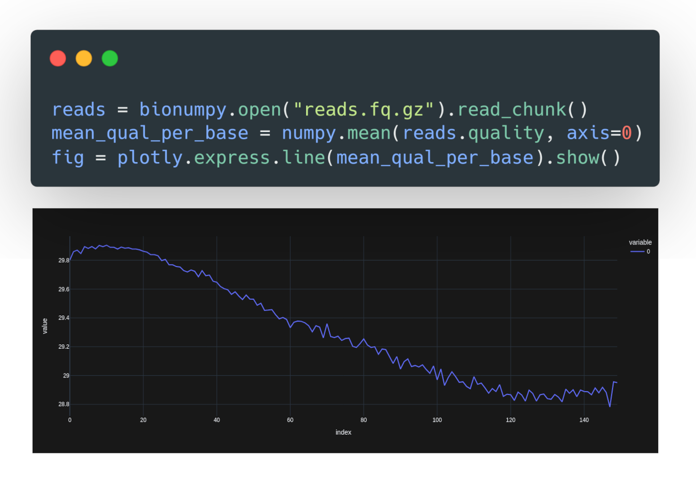

---
title: Array programming for Biology
keywords:
- markdown
- publishing
- manubot
lang: en-US
date-meta: '2023-12-06'
author-meta:
- Knut Dagestad Rand
- Ivar Grytten
- Milena Pavlović
- Chakravarthi Kanduri
- Geir Kjetil Sandve
header-includes: |
  <!--
  Manubot generated metadata rendered from header-includes-template.html.
  Suggest improvements at https://github.com/manubot/manubot/blob/main/manubot/process/header-includes-template.html
  -->
  <meta name="dc.format" content="text/html" />
  <meta property="og:type" content="article" />
  <meta name="dc.title" content="Array programming for Biology" />
  <meta name="citation_title" content="Array programming for Biology" />
  <meta property="og:title" content="Array programming for Biology" />
  <meta property="twitter:title" content="Array programming for Biology" />
  <meta name="dc.date" content="2023-12-06" />
  <meta name="citation_publication_date" content="2023-12-06" />
  <meta property="article:published_time" content="2023-12-06" />
  <meta name="dc.modified" content="2023-12-06T14:51:28+00:00" />
  <meta property="article:modified_time" content="2023-12-06T14:51:28+00:00" />
  <meta name="dc.language" content="en-US" />
  <meta name="citation_language" content="en-US" />
  <meta name="dc.relation.ispartof" content="Manubot" />
  <meta name="dc.publisher" content="Manubot" />
  <meta name="citation_journal_title" content="Manubot" />
  <meta name="citation_technical_report_institution" content="Manubot" />
  <meta name="citation_author" content="Knut Dagestad Rand" />
  <meta name="citation_author_institution" content="Biomedical Informatics research group, Department of Informatics, University of Oslo, Oslo, Norway" />
  <meta name="citation_author_institution" content="Centre for Bioinformatics, University of Oslo, Oslo, Norway" />
  <meta name="citation_author" content="Ivar Grytten" />
  <meta name="citation_author_institution" content="Biomedical Informatics research group, Department of Informatics, University of Oslo, Oslo, Norway" />
  <meta name="citation_author" content="Milena Pavlović" />
  <meta name="citation_author_institution" content="Biomedical Informatics research group, Department of Informatics, University of Oslo, Oslo, Norway" />
  <meta name="citation_author_institution" content="UiORealArt Convergence Environment, University of Oslo, Oslo, Norway" />
  <meta name="citation_author" content="Chakravarthi Kanduri" />
  <meta name="citation_author_institution" content="Biomedical Informatics research group, Department of Informatics, University of Oslo, Oslo, Norway" />
  <meta name="citation_author_institution" content="UiORealArt Convergence Environment, University of Oslo, Oslo, Norway" />
  <meta name="citation_author" content="Geir Kjetil Sandve" />
  <meta name="citation_author_institution" content="Biomedical Informatics research group, Department of Informatics, University of Oslo, Oslo, Norway" />
  <meta name="citation_author_institution" content="Centre for Bioinformatics, University of Oslo, Oslo, Norway" />
  <meta name="citation_author_institution" content="UiORealArt Convergence Environment, University of Oslo, Oslo, Norway" />
  <link rel="canonical" href="https://bionumpy.github.io/bionumpy-correspondence/" />
  <meta property="og:url" content="https://bionumpy.github.io/bionumpy-correspondence/" />
  <meta property="twitter:url" content="https://bionumpy.github.io/bionumpy-correspondence/" />
  <meta name="citation_fulltext_html_url" content="https://bionumpy.github.io/bionumpy-correspondence/" />
  <meta name="citation_pdf_url" content="https://bionumpy.github.io/bionumpy-correspondence/manuscript.pdf" />
  <link rel="alternate" type="application/pdf" href="https://bionumpy.github.io/bionumpy-correspondence/manuscript.pdf" />
  <link rel="alternate" type="text/html" href="https://bionumpy.github.io/bionumpy-correspondence/v/b36242774236f1e754daa12eac7422e4a16d924c/" />
  <meta name="manubot_html_url_versioned" content="https://bionumpy.github.io/bionumpy-correspondence/v/b36242774236f1e754daa12eac7422e4a16d924c/" />
  <meta name="manubot_pdf_url_versioned" content="https://bionumpy.github.io/bionumpy-correspondence/v/b36242774236f1e754daa12eac7422e4a16d924c/manuscript.pdf" />
  <meta property="og:type" content="article" />
  <meta property="twitter:card" content="summary_large_image" />
  <link rel="icon" type="image/png" sizes="192x192" href="https://manubot.org/favicon-192x192.png" />
  <link rel="mask-icon" href="https://manubot.org/safari-pinned-tab.svg" color="#ad1457" />
  <meta name="theme-color" content="#ad1457" />
  <!-- end Manubot generated metadata -->
bibliography:
- content/manual-references.json
manubot-output-bibliography: output/references.json
manubot-output-citekeys: output/citations.tsv
manubot-requests-cache-path: ci/cache/requests-cache
manubot-clear-requests-cache: false
...

<small><em>
This manuscript
([permalink](https://bionumpy.github.io/bionumpy-correspondence/v/b36242774236f1e754daa12eac7422e4a16d924c/))
was automatically generated
from [bionumpy/bionumpy-correspondence@b362427](https://github.com/bionumpy/bionumpy-correspondence/tree/b36242774236f1e754daa12eac7422e4a16d924c)
on December 6, 2023.
</em></small>

## Authors

+ **Knut Dagestad Rand**
  ^[✉](#correspondence)^ 
  <small>
     Biomedical Informatics research group, Department of Informatics, University of Oslo, Oslo, Norway; Centre for Bioinformatics, University of Oslo, Oslo, Norway
  </small>

+ **Ivar Grytten**
   
  <small>
     Biomedical Informatics research group, Department of Informatics, University of Oslo, Oslo, Norway
  </small>

+ **Milena Pavlović**
   
  <small>
     Biomedical Informatics research group, Department of Informatics, University of Oslo, Oslo, Norway; UiORealArt Convergence Environment, University of Oslo, Oslo, Norway
  </small>

+ **Chakravarthi Kanduri**
   
  <small>
     Biomedical Informatics research group, Department of Informatics, University of Oslo, Oslo, Norway; UiORealArt Convergence Environment, University of Oslo, Oslo, Norway
  </small>

+ **Geir Kjetil Sandve**
   
  <small>
     Biomedical Informatics research group, Department of Informatics, University of Oslo, Oslo, Norway; Centre for Bioinformatics, University of Oslo, Oslo, Norway; UiORealArt Convergence Environment, University of Oslo, Oslo, Norway
  </small>

::: {#correspondence}
✉ — Correspondence possible via [GitHub Issues](https://github.com/bionumpy/bionumpy-correspondence/issues)
or email to
Knut Dagestad Rand \<knutdr@math.uio.no\>.

:::

Array Programming for Biology
=============================

To the editor:

Python is a widely used programming language for scientific computing, in large part due to the powerful *array programming* library NumPy [@numpy], which makes it easy to write clean, vectorized and computationally efficient code for handling large datasets. A challenge with using array programming in biology is that the data is often non-numeric and variable-length (e.g. DNA sequences), inhibiting out-of-the-box use of standard array programming techniques.This may push bioinformaticians to instead rely on complex, custom pipelines of UNIX commands that are non-transparent and error-prone. Furthermore, the impracticality of developing efficient code directly in high-level languages like Python has led to tool developers almost exclusively relying on low-level languages like C and C++, making it more difficult for computational biologists to understand and contribute to core methods in the field. 

We present the BioNumPy package, which enables efficient and intuitive array programming on biological data in Python. This is achieved by storing biological datasets in data structures built on top of underlying NumPy arrays (see Supplementary Material). BioNumPy supports a broad range of bioinformatics analyses, with the main philosophy being that data structures should behave as closely as possible to standard numeric NumPy arrays. This means that BioNumPy is easy to learn for users familiar with NumPy or with array programming languages like R and Matlab. BioNumPy is open-source and freely available at https://github.com/bionumpy/bionumpy/, and can be installed through the Python package manager Pip. BioNumPy comes with extensive documentation and a user guide that makes it easy to use for a wide range of molecular biology datasets and problems.

BioNumPy is able to read and write biological datasets (e.g FASTQ, BAM, or VCF-files) directly to/from NumPy-like data structures, providing efficient access to the data through an intuitive and easy-to-use API. The data is then  processed and analysed efficiently using a NumPy-like interface.

In Figure @fig:figure1, we showcase BioNumPy by reading sequenced reads from a FASTQ file and plotting the average base quality per read position. Both the sequences and base qualities are represented in NumPy-compatible arrays, so that NumPy-functionality like e.g. np.mean can be used. 

{#fig:figure1}

 
We show through a range of experiments that BioNumPy is considerably faster than existing Python packages for common bioinformatics tasks and, in many cases, as fast as tools written in C/C++ (see Supplementary Material). We also showcase how BioNumPy enables seamless machine learning on biological sequence data by  reproducing  parts of a recent machine learning benchmark study using only X lines of code (as compared to Y lines in the original implementation).  (Supplementary Material). 

In conclusion, we believe that BioNumPy bridges a long-lasting gap by making array programming practical for the field of biology.

## References {.page_break_before}

<!-- Explicitly insert bibliography here -->

